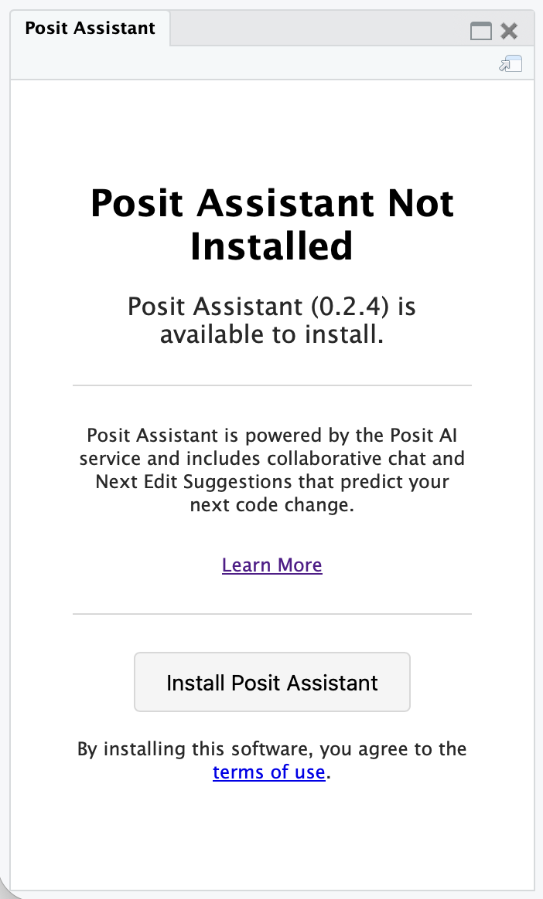
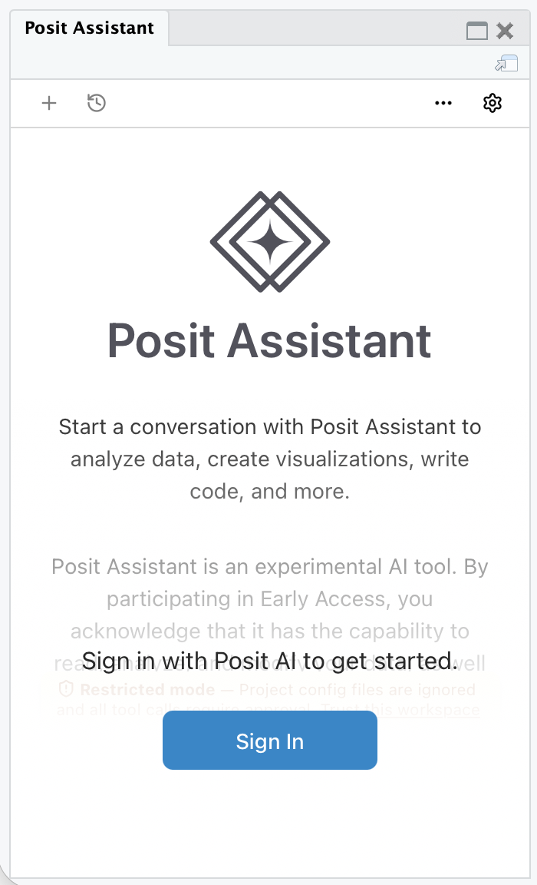

[Posit Assistant](https://pos.it/assistant) is a set of artificial intelligence (AI) features available as a downloadable extension for RStudio. To provide feedback or report bugs, please open a [GitHub Issue on the RStudio repository](https://github.com/rstudio/rstudio/issues).

## Prerequisites

-   To use Posit Assistant in RStudio, you must have a compatible version of RStudio installed. Posit Assistant is available for RStudio Desktop or Server 2026.04.0 and later. Posit Workbench disables Posit Assistant by default, but an administrator can enable it.
-   To use Posit Assistant, you must have access to the internet in order to send requests to the Posit AI APIs and receive suggestions.

::: {.callout-note title="Posit Assistant in RStudio Server and Workbench"}
Support for RStudio Server and Posit Workbench is currently considered experimental and will be fully supported in a future release.
:::

## Setup

To configure Posit Assistant in RStudio click on the "Posit Assistant" button on the toolbar to display the "Posit Assistant" pane.

{fig-alt="Posit Assistant Toolbar Button" fig-align="left"}

Click **Install Posit Assistant** to download and install the add-in package, then click **Sign In** to login and signup for Posit-AI.

::: {.callout-note title="Posit AI Account Assistance"}
For more information on signing up and managing your Posit AI account visit <https://docs.posit.co/posit-ai>.
:::

::: {layout-ncol="2"}
{fig-alt="Install Posit Assistant"}

{fig-alt="Sign in to Posit AI"}
:::

Once signed up and authenticated, the Posit Assistant chat feature is ready to use.

## Using Posit Assistant

For information on using Posit Assistant, visit the [Posit Assistant documentation](https://pos.it/assistant-docs).

## Removing Posit Assistant

To uninstall the downloaded Posit Assistant components, select **Help** \> **Diagnostics** \> **Uninstall Posit Assistant**. RStudio restarts after the uninstall completes.

RStudio preserves your chat history and account settings, which remain available if you reinstall Posit Assistant.

## Hiding Posit Assistant features

To disable and hide the Posit Assistant features entirely, set the `RSTUDIO_DISABLE_POSIT_ASSISTANT` environment variable to any value (e.g., `RSTUDIO_DISABLE_POSIT_ASSISTANT=1`) before starting RStudio. When the variable is set, RStudio does not display the Posit Assistant toolbar button or pane, and you cannot install or use Posit Assistant in that session.

On RStudio Server, administrators can also disable Posit Assistant for all users by adding the following line to `/etc/rstudio/rsession.conf`:

```ini
posit-assistant-enabled=0
```

See the [Environment Variables](../../reference/environment-variables.qmd) reference for other environment variables that affect RStudio.
