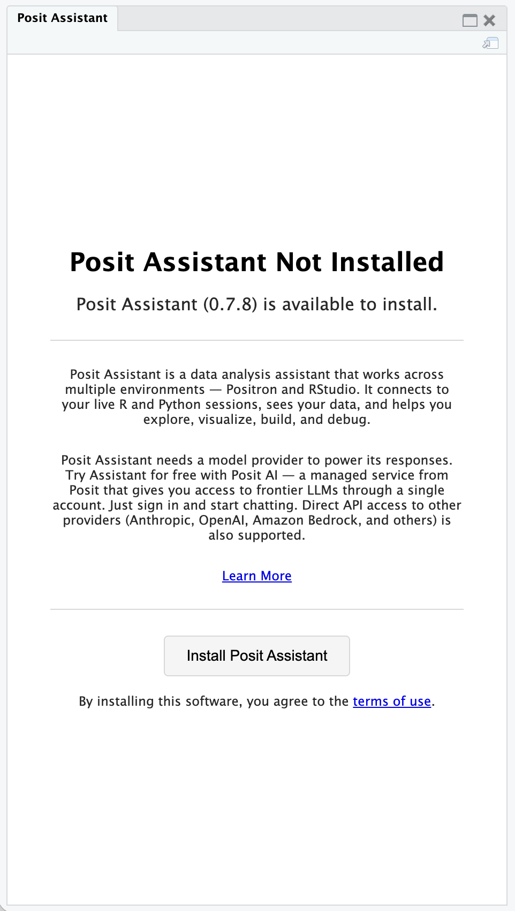
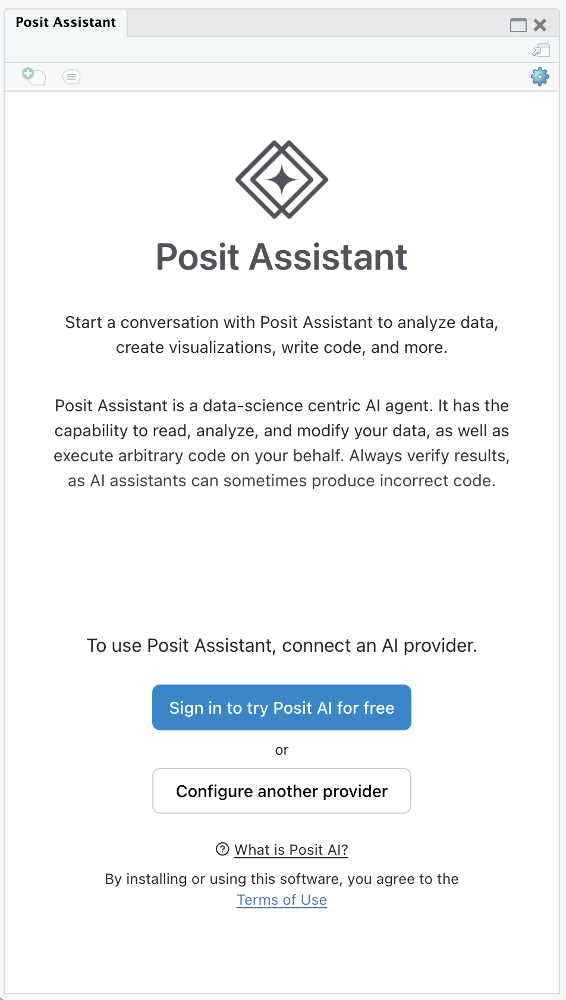

[Posit Assistant](https://pos.it/assistant) is a set of artificial intelligence (AI) features available as a downloadable extension for RStudio. To provide feedback or report bugs, please open a [GitHub Issue](https://github.com/posit-dev/assistant-feedback/issues).

## Prerequisites

-   To use Posit Assistant in RStudio, you must have a compatible version of RStudio installed. Posit Assistant is available for RStudio Desktop or Server 2026.04.0 and later. Posit Workbench disables Posit Assistant by default, but an administrator can enable it.
-   To use Posit Assistant, you need access to a model provider. Posit AI is the recommended provider, and other providers such as Anthropic, OpenAI, Google Gemini, and Amazon Bedrock are also supported. Most providers are cloud-based and require internet access to send requests and receive responses.

::: {.callout-note title="Posit Assistant in RStudio Server and Workbench"}
Support for RStudio Server and Posit Workbench is currently considered experimental and will be fully supported in a future release.
:::

## Setup

To set up Posit Assistant in RStudio, click the "Posit Assistant" button on the toolbar to display the "Posit Assistant" pane.

{fig-alt="Posit Assistant Toolbar Button" fig-align="left"}

Click **Install Posit Assistant** to download and install the add-in package. Once the installation completes, configure a model provider as described below before you begin chatting.

{fig-alt="Install Posit Assistant" fig-align="center" width="350"}

## Choosing a model provider

Posit Assistant works with several model providers. Posit AI is the recommended provider for most users, but you can also connect directly to other providers.

{fig-alt="Configure Posit Assistant" fig-align="center" width="350"}

### Posit AI

[Posit AI](https://docs.posit.co/posit-ai) is a managed service from Posit that provides access to a range of frontier LLMs through a single account. Click **Sign in to try Posit AI for free** to sign in to or create a Posit AI account. Once you are authenticated, the Posit Assistant chat feature is ready to use.

::: {.callout-note title="Posit AI Account Assistance"}
For more information on signing up and managing your Posit AI account visit <https://docs.posit.co/posit-ai>.
:::

### Other providers

Posit Assistant also supports direct connections to providers such as Anthropic, OpenAI, Google Gemini, and Amazon Bedrock, among others. On the welcome screen, click **Configure another provider**, then choose the provider and enter its credentials. After initial setup, you can add or change providers from the settings (gear) menu in the Posit Assistant pane.

## Advanced configuration

Posit Assistant reads its configuration from JSON settings files: a global file at `~/.posit/assistant/settings.json` and an optional per-project file at `.posit/assistant/settings.json`. Editing these files directly lets you set options that are not exposed in the user interface, such as custom provider base URLs, request headers, permissions, and MCP servers.

For the full list of available settings, see the [Posit Assistant configuration file reference](https://assistant.posit.co/docs/reference/config-file/).

## Using Posit Assistant

For information on using Posit Assistant, visit the [Posit Assistant documentation](https://pos.it/assistant-docs).

## Removing Posit Assistant

To uninstall the downloaded Posit Assistant components, select **Help** \> **Diagnostics** \> **Uninstall Posit Assistant**. RStudio restarts after the uninstall completes.

RStudio preserves your chat history and account settings, which remain available if you reinstall Posit Assistant.

## Hiding Posit Assistant features

To disable and hide the Posit Assistant features entirely, set the `RSTUDIO_DISABLE_POSIT_ASSISTANT` environment variable to any value (e.g., `RSTUDIO_DISABLE_POSIT_ASSISTANT=1`) before starting RStudio. When the variable is set, RStudio does not display the Posit Assistant toolbar button or pane, and you cannot install or use Posit Assistant in that session.

On RStudio Server, administrators can also disable Posit Assistant for all users by adding the following line to `/etc/rstudio/rsession.conf`:

```ini
posit-assistant-enabled=0
```

See the [Environment Variables](../../reference/environment-variables.qmd) reference for other environment variables that affect RStudio.

## Terms and Conditions

-   [Posit Assistant](posit-assistant-terms.qmd)
