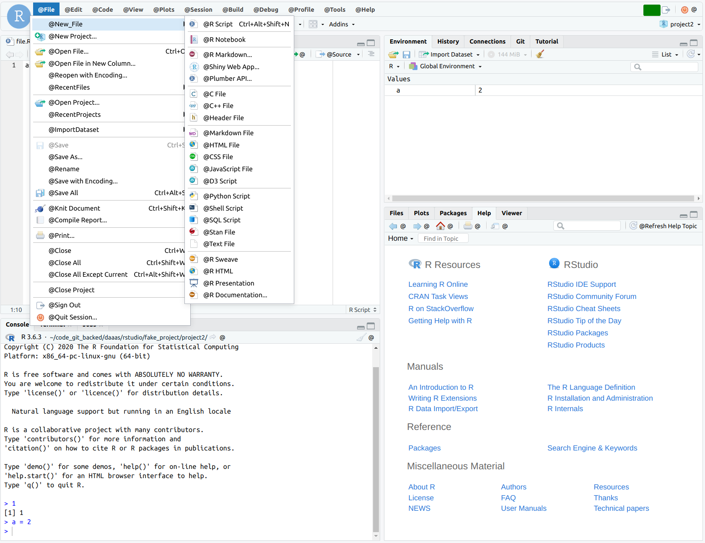

# Summary

This README describes the internationalization (i18n) development workflow and helper tools available.

After making any change (even whitespace-only) to Commands.cmd.xml, you must run one of
`ant`, `ant draft`, or `ant generate-i18n` and commit all modified files along with Commands.cmd.xml.
Failure to do this will break the RStudio build.

This workflow requires Python3 to be active, and the requirements in commands.cmd.xml/requirements.txt
to have been installed (i.e. with `pip install -r requirements.txt`).

# i18n in RStudio

## Implementation Details

i18n is implemented using GWT's [i18n](http://www.gwtproject.org/doc/latest/DevGuideI18n.html) features, typically through static string internationalization.  Until i18n has been enabled across RStudio, non-English locales are enabled only when running `ant` in `SuperDevMode`.  

To localize part of the codebase, define interfaces that extend `com.google.gwt.i18n.client.Constants` and `.Messages`.  Include `String`s with `@DefaultStringValue`s in the interfaces for all localized text, and cite these `String` objects in your code to get their text values.  To add locales to your application, add properties files called `INTERFACENAME_LOCALE.properties`.  An example of this implemented is available in `src/org/rstudio/studio/client/application/ui/AboutDialog.java`, which cites:
* `AboutDialogConstants.java` (interface for constants)
* `AboutDialogConstants_en.properties` (English locale for constants)
* `AboutDialogConstants.java` (interface for messages)
* `AboutDialogMessages_en.properties` (English locale for messages)

When debugging, access non-English locales from `SuperDevMode` by adding `?locale=yourLocale` to the RStudio URL (for example, `http://localhost:8787/?locale=yourLocale`).

When serving localized content, GWT will serve it in the following order:
* Locale matching the locale selected, if available (if `?locale=en`, serve `*_en.properties` if it is available)
* Default locale (defined in `RStudio.gwt.xml` or other XML files), if available
* The `@DefaultStringValue` text

GWT suggests you always include both a `@DefaultStringValue` and at least one `.properties` file.

## Development Workflow 

When implementing i18n and going from hard-coded English text to text from an English properties file, it can be hard to know what is/is not translated and whether your translations are actually working because you are "translating" without changing the visible content.  One workflow to help with this problem is to use a "dev" locale which applies easily visible changes to the text for development purposes.  The "dev" locale is:
* a copy of the current English locale's `.properties` files, with "@" prepended to all constants and messages to make them clearly visible in the UI
* enabled when in SuperDevMode (server or desktop) and accessible at `http://localhost:8787/?locale=dev`, but not accessible during production use (see `RStudioSuperDevMode.gwt.xml`/`RStudioDesktopSuperDevMode.gwt.xml`)
* intended to be generated when needed during development and to be committed with the codebase (files are ignored in `.gitignore`)

For example, below shows a "dev" locale where menus and commands have i18n support but other text does not:



# Tools

The following tools are included to help with i18n development:

## create_dev_locale.sh

Useful for debugging i18n and visually confirming what is/is not i18n-enabled by creating `*_dev.properties` files from
existing `*_en.properties` files.  The script copies the English properties files and prefixes their texts with `@`.

Run this script from `/src/gwt/src` with syntax `./create_dev_locale.sh`

## commands_xml_to_i18n.py

### Summary

Auto-generates java interfaces and properties files for all commands and menus defined with `Commands.cmd.xml` using 
the English text in that file.  This script must be run whenever `Commands.cmd.xml` is edited, and is automatically
executed whenever changes to this file are detected and the `build`, `desktop`, or `devmode` ant targets are triggered.

Usage below shows how to trigger the scripts manually (instead of via ant buildfile targets) for the creation of English
and "dev" locales, as discussed above for `create_dev_locale.sh`

TODO: Shortcuts in Commands.cmd.xml are not currently localizable.

### Usage

See `commands_xml_to_i18n.py -h` for more details on options.

Typical usage (from the `commands.cmd.xml` subfolder) is:

```shell
CMD_DIR="../../../src/org/rstudio/studio/client/workbench/commands/"

# Commands
# Interface (no prefix added to texts)
python commands_xml_to_i18n.py "${CMD_DIR}/Commands.cmd.xml" cmd constant "${CMD_DIR}/CmdConstants.java" --package "package org.rstudio.studio.client.workbench.commands;"
# English (en) properties file (no prefix added to texts)
python commands_xml_to_i18n.py "${CMD_DIR}/Commands.cmd.xml" cmd properties "${CMD_DIR}/CmdConstants_en.properties"
# (optional) Development (dev) properties file (prefix "@" added to all texts for development - see Summary)
python commands_xml_to_i18n.py "${CMD_DIR}/Commands.cmd.xml" cmd properties "${CMD_DIR}/CmdConstants_dev.properties" --prefix "@"

# Menus
# Interface (no prefix added to texts)
python commands_xml_to_i18n.py "${CMD_DIR}/Commands.cmd.xml" menu constant "${CMD_DIR}/MenuConstants.java" --package "package org.rstudio.studio.client.workbench.commands;"
# English (en) properties file (no prefix added to texts)
python commands_xml_to_i18n.py "${CMD_DIR}/Commands.cmd.xml" menu properties "${CMD_DIR}/MenuConstants_en.properties"
# (optional) Development (dev) properties file (prefix "@" added to all texts for development - see Summary)
python commands_xml_to_i18n.py "${CMD_DIR}/Commands.cmd.xml" menu properties "${CMD_DIR}/MenuConstants_dev.properties" --prefix "@"
```

### Tests

A minimal test suite for the tool is available using `python -m pytest ./test_command.py`
